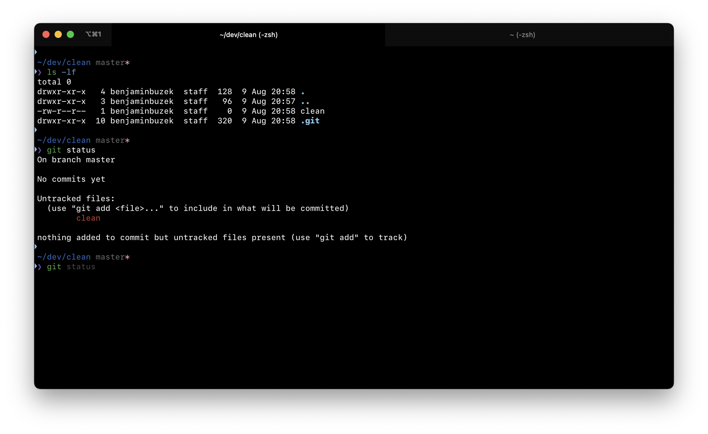

# set-up-terminal

This repository provides a setup guide for my minimalist and efficient macOS terminal environment, tailored for daily use.



## Dependencies / Requirements

* [Homebrew](https://brew.sh/)
* [iTerm2](https://iterm2.com/)
* [Oh My Zsh](https://ohmyz.sh/)
* [zplug](https://github.com/zplug/zplug)
* [pure](https://github.com/sindresorhus/pure#readme)
* [SF Mono Font](https://developer.apple.com/fonts/)

## ⚙️ Configure iTerm2

You can install iTerm2 with brew.

```
brew install --cask iterm2
```

Under `Settings > Appearance > Windows` check `Show window number in title bar`.

Under `Settings > Appearance > General > Theme` change the theme to `Minimal`.

Under `Settings > Advanced` set the field "In the Minimal theme, how prominent should the tab outline be?" to `0`.

Under `Settings > Profiles > Text` change the font to `SF Mono` and use size `13`. You can get the SF Mono font from [here](https://developer.apple.com/fonts/).

## ⚙️ Configure zsh

Install the [Oh My Zsh](https://ohmyz.sh/) framework.

```zsh
sh -c "$(curl -fsSL https://raw.github.com/ohmyzsh/ohmyzsh/master/tools/install.sh)"
```

Install [zplug](https://github.com/zplug/zplug) for managing zsh plugins.

```
brew install zplug
```

Configure your `~/.zshrc` file.

```zsh
# ~/.zshrc configuration

# Set env variables
export ZSH=~/.oh-my-zsh
export ZPLUG_HOME=/usr/local/opt/zplug

# Disable zsh themes
ZSH_THEME=""

# Load files
source $ZSH/oh-my-zsh.sh
source $ZPLUG_HOME/init.zsh

# Install zplug plugins
zplug "mafredri/zsh-async", from:github
zplug "sindresorhus/pure", use:pure.zsh, from:github, as:theme
zplug "zdharma/fast-syntax-highlighting", as:plugin, defer:2
zplug "zsh-users/zsh-autosuggestions", as:plugin, defer:2
zplug load

# Install plugins if there are plugins that are not installed.
if ! zplug check --verbose; then
    printf "Install? [y/N]: "
    if read -q; then
        echo; zplug install
    fi
fi
```

Reload your `~/.zshrc` configuration.

```
source ~/.zshrc
```